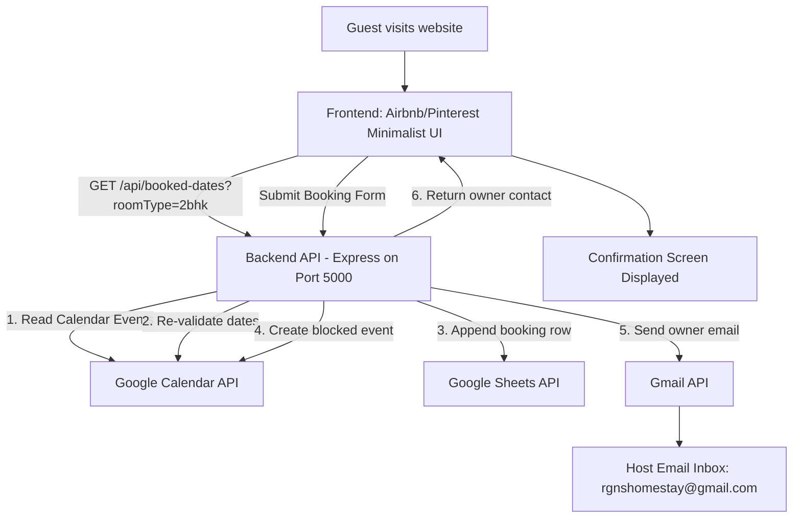

# 🏡 RGN's Homestay Homestyle Living — Karur

A full-stack homestay booking web application for **RGN's Homestay Homestyle Living (Karur)** built with Node.js, Express, React, and Google Cloud APIs (**Google Calendar API**, **Google Sheets API**, and **Gmail API**). Designed with a clean, minimalist white theme inspired by **Airbnb** & **Pinterest**.

---

## 🌟 Key Features

- **Airbnb & Pinterest Minimalist White Design**:
  - Pristine white cards, floating pill navigation, multi-part search bar, and Pinterest masonry visual gallery.
  - Custom mossy brick background texture with subtle atmospheric overlay.
  - Signature Airbnb Coral Red (`#FF385C`) accents.

- **Accommodations & Inclusions**:
  - **2BHK Full Home**: ₹8,000 / night (Base Rate) + ₹500 one-time cleaning charge.
  - **1BHK Suite**: ₹6,000 / night + ₹500 one-time cleaning charge.
  - **Inclusions**: Covered Reserved Parking (Free), Welcome Drink Included, AC rooms, Purified RO water, Safety lockers, Free board games.

- **Host & Location**:
  - **Host Manager**: Mrs S Gowri
  - **Contact**: +91 70107 75902 | `rgnshomestay@gmail.com`
  - **Address**: 25/4 Kamaraj Nagar, Sungagate, Near Sungagate Bus stop, Thanthonimalai Post, Karur-639004
  - **Location Highlight**: 10 Mins Walk to Sri Thanthonimalai Perumal Temple & Thirumurugan Mahal.
  - **Timings**: Check-in 2:00 PM • Check-out 2:00 PM

- **Google Cloud APIs Integration (Free Tiers)**:
  1. **Google Calendar API v3**:
     - `GET /api/booked-dates?roomType=...`: Reads upcoming calendar events to disable booked dates.
     - `checkAvailability()`: Re-validates overlap (`start < checkOut && end > checkIn`) before booking.
     - `createBookingEvent()`: Inserts calendar event titled `"[roomType] Booking - [Guest Name]"` spanning check-in to check-out.
  2. **Google Sheets API v4**:
     - `appendBookingRow()`: Appends structured row logs (`Timestamp, Booking ID, Name, Phone, Email, Room Type, Check-in, Check-out, Guests, Status`).
  3. **Gmail API v1**:
     - `sendOwnerNotification()`: Encodes RFC 2822 email and sends alert emails directly to host inbox (`rgnshomestay@gmail.com`).

- **Development Mock Mode**:
  - If Google credentials are not yet set in environment variables, the backend automatically operates in mock mode so local development and UI testing work out-of-the-box.

---

## 📐 Architecture Overview



---

## 📂 Repository Structure

```
rgnshomestay/
├── backend/
│   ├── src/
│   │   ├── routes/
│   │   │   ├── availability.js   # GET /api/booked-dates
│   │   │   └── booking.js        # POST /api/book
│   │   ├── services/
│   │   │   ├── googleAuth.js     # OAuth2 Client with Refresh Token
│   │   │   ├── calendarService.js # Google Calendar read/write
│   │   │   ├── sheetsService.js   # Google Sheets database append
│   │   │   └── gmailService.js    # Gmail notification dispatch
│   │   └── index.js              # Express app & static server
│   ├── .env.example
│   └── package.json
├── frontend/
│   ├── src/
│   │   ├── components/
│   │   │   ├── BookingForm.jsx
│   │   │   ├── Calendar.jsx
│   │   │   └── ConfirmationScreen.jsx
│   │   ├── api.js
│   │   ├── App.jsx
│   │   └── main.jsx
│   ├── index.html
│   └── package.json
├── code.html                     # Unified fullstack frontend
├── index.html
├── bg-moss.jpg                   # Moss background texture
└── README.md
```

---

## ⚡ Quickstart & Local Setup

### 1. Clone the Repository
```bash
git clone https://github.com/narenrraju/rgnshomestay.git
cd rgnshomestay
```

### 2. Install & Start Backend
```bash
cd backend
npm install
npm start
```
*The full-stack application will start on **http://localhost:5000***.

### 3. Environment Variables (`backend/.env`)
Copy `.env.example` to `.env` in the `backend` directory:
```env
GOOGLE_CLIENT_ID=your-client-id
GOOGLE_CLIENT_SECRET=your-client-secret
GOOGLE_REDIRECT_URI=http://localhost:5000/oauth2callback
GOOGLE_REFRESH_TOKEN=your-refresh-token

OWNER_EMAIL=rgnshomestay@gmail.com
OWNER_PHONE=+917010775902
OWNER_CALENDAR_ID=primary

SHEET_ID=your-google-sheet-id
PORT=5000
```

---

## 📄 Policies

- **Privacy Policy**: All personal details given will be considered as booking individual details and collected exclusively for homestay use.
- **Guest Guidelines**: Follow all rules mentioned by the homestay manager.
- **Cancellation Policy**: Cancellation non-refundable.

---

## 📜 License

MIT License © 2026 RGN's Homestay Homestyle Living. Managed by Mrs S Gowri.
